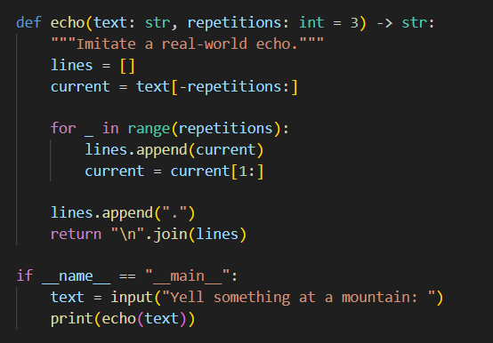
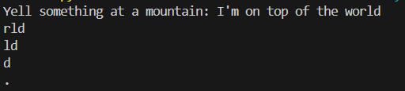
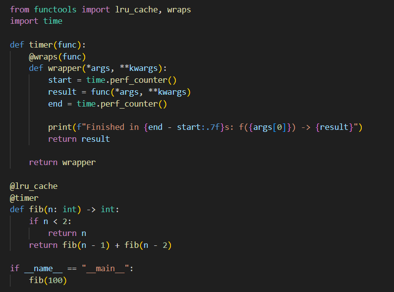
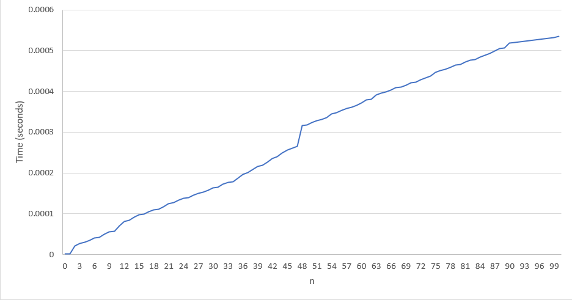

# Assignment 1: Python Refresher
## 1. Python Programming Basics
The ```echo.py``` file aims to mimic a real-world echo. Given inputs ```text``` (a string) and ```repetitions``` (an int), the mountain will echo ```text``` a ```repetitions``` number of times.

The screenshot below shows the code in the ```echo.py``` file.



For example, if ```text = I'm on top of the world```, and ```repetition = 3```, the following is the result:



The trailing letters represent the fading of an echoed sound effect.


## 2. Python Decorator Information
The ```fib.py``` file computes the nth Fibonacci sequence number, while also calculating how much time it takes to compute each one, using a ```timer``` decorator. 

The screenshot below shoes the code in the ```fib.py``` file.


Once run, the output should look something like what is shown below, with the time it took to run on the left hand side, and the fibonacci sequence number on the right
```
Finished in 0.0000012s: f(1) -> 1
Finished in 0.0000013s: f(0) -> 0
Finished in 0.0000295s: f(2) -> 1
Finished in 0.0000358s: f(3) -> 2
...
...
...
Finished in 0.0005437s: f(98) -> 135301852344706746049
Finished in 0.0005461s: f(99) -> 218922995834555169026
Finished in 0.0005499s: f(100) -> 354224848179261915075
```


The following plot was created in Excel, and it shows the time it took to execute each Fibonacci sequence number from 0-100. The x-axis the n in Fibonacci number calculation, and the y-axis represents how long it took (in seconds).


The plot remains relatively steady and exhibits an almost linear trend. One noticeable feature occurs near the middle of the sequence: between n = 47 and n = 48, there is the largest increase in execution time, with a jump of approximately 0.0001 seconds.
